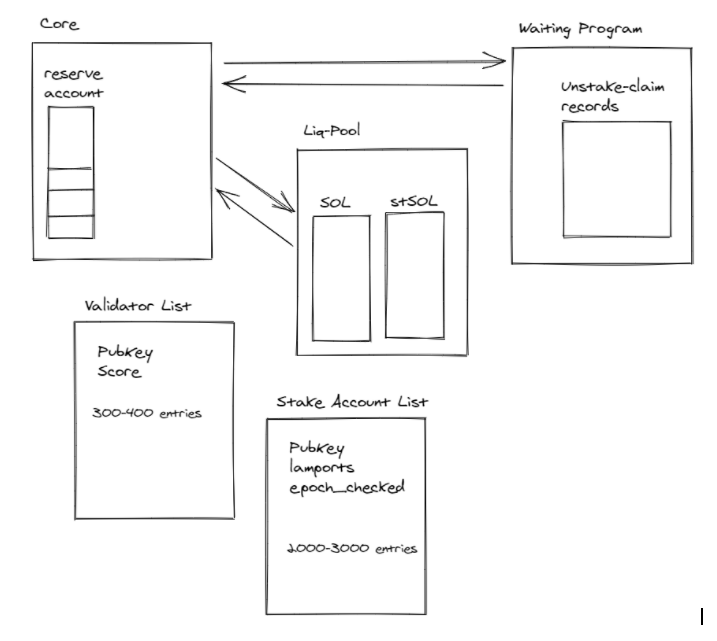

## INDEX

- [Basic User Interface](#Basic-User-Interface)
- [Advanced User Interface](#Advanced-User-Interface)
- [Crank-Turning Bot](#Crank-Turning-Bot)


## General Diagram



## Basic User Interface

### Actions: Stake SOL / Liquid Unstake

Key business objective: **Reduce friction. Make it easier for the user to stake/unstake without waiting periods.**

Status: working

Current design. Pros: easier, no need for price synchronization, we replenish liquidity from delta stakes/unstakes. swap fees.

#### Stake SOL: 

* We take user’s SOL
* We store SOL in the reserve account
* reserve_pda += amount // amounts in reserve_pda corresponding to stake_orders will be staked before the end of the epoch 
* We mint mSOL for the user
* Fin

#### Liquid Unstake, example:

* The liq pool is 10k
* Alice liquid unstakes 1000 SOL (and sends 1005 mSOL to do that)
* the SOL for Alice comes from the liq.pool, "liquid unstaking" is akin to swapping mSOL->SOL in the liq pool
* after the operation, alice has her SOL, and now the liq pool has:
1. 9000 SOL
2. 1005 mSOL
* but the liq-pool "needs" to be completely unbalanced to work at lower fees, so it "needs" to get rid of the mSOL and get more SOL (Alice's opposite operation)
* So when a stake order comes in, instead of initiating a staking process, we do the inverse swap operation, at no cost for the user
* So bob wants to stake 1500 SOL, the program 1st gets 1005 mSOL from the liq.pool for bob and enters 1005 SOL into the liq pool (now the pool is again "replenished"/fully unbalanced in the good way)
* we reserve the additional 495 in a reserve account.
* The same clearing is performed at the end of the epoch (those 495 can go thru the same swap if another user liquid-unstaked and send some mSOL into the liq-pool), if not, we start the staking-process for the 495 SOL.


## User stories - Happy path

### Alice

Alice wants to stake her SOL with low risk, and also help the community by promoting decentralization and censorship-resistance for the network.

Alice stakes 750,000 SOL in Marinade. `fn deposit_sol` Her 750,000 SOL are distributed between top 100 validators by performance by an automatic distribution mechanism to keep the validators balanced. She gets 750,000 mSOL tokens.

She starts earning staking rewards on her mSOL, she can track precisely her rewards by mSOL price increases. By holding mSOL she has tokenized her stake, she can participate in other markets, and also she can Liquid-Unstake some of her mSOL skipping the waiting period if the need arises `fn liquid_unstake`.

Steps:
* `fn deposit_sol` 750,000 SOL -> she gets mSOL
* `fn liquid_unstake` 100 mSOL -> she gets SOL


### Bob
Bob already has staked SOL. He holds a 10,000 SOL activated stake-account.

Bob needs to unstake 5,000 SOL to use in an emergency. He can’t wait 6 days cool-down period to get his SOL.

Bob deposits his stake-account he gets, 10,000 mSOL tokens.

Bob Liquid-Unstakes 5,050 mSOL and he gets 5,000 SOL (He’s paying a 1% fee to get his SOL immediately). Bob gets SOL in his account. Bob can use his SOL immediately.

Steps: 
* `fn deposit_stake_account` 10,000 SOL locked in a stake-account -> he gets mSOL
* `fn liquid_unstake` 5,050 mSOL -> he gets SOL

### Carol
Carol is an investor. She wants to provide liquidity for the Liquid-Unstake function for a short period, earning swap fees. Carol deposits 7,000 SOL in the Liquidity Pool, she is the first in the pool, so she gets 7,000 shares of the Liquidity Pool (LP-tokens)

Bob swaps 5,050 mSOL for 5,000 SOL. He pays a 1% fee to get the SOL immediately. The Liquidity Pool delivers 5,000 SOL to Bob and acquires 5,050 mSOL from Bob. The new value of the Liquidity Pool is 7,050 SOL (2,000 SOL + 5,050 mSOL),

Carol share value has increased and now she owns some mSOL via the Liquidity Pool. Carol burns all her shares and retrieves 2,000 SOL and 5,050 mSOL into her account. Carol has now 7,050 SOL value. Carol earned 0.7% in a few epochs. Had her normally staked 7,000 SOL, she would have earned only 0.005% in the same period.

Steps: 
* `fn add_liquidity` 7,000 -> she gets 7,000 mSOL-SOL-LP
* `fn remove_liquidity` 7,000 mSOL-SOL-LP -> she gets 2,000 SOL and 5,050 mSOL

### Dave
Dave is a Liquidity Provider. He wants to provide continuous liquidity for the Liquidity Pool, in order to earn a fee on each operation.

Being a Liquidity Provider can bring-in more earnings than just staking, while helping the community at the same time by providing liquid unstaking for other users.

Dave enters 100,000 SOL to the Liquidity Pool, he gets shares of the Liquidity Pool.

Eve swaps 50,500 mSOL for 50,000 SOL. She pays a 1% fee price to get her SOL immediately.

The Liquidity Pool delivers 50,000 SOL to Eve and acquires 50,500 mSOL from Eve. The Liquidity Pool has a low amount of SOL now. During the epoch the liquidity pool uses an internal clearing mechanism to acquire SOL by selling mSOL and restore liquidity automatically. After several operations, the liq-pool will have liquidity restored at 100,500 SOL.

As the Liquidity Pool operates, the SOL value of the pool grows with fees, so does mSOL-SOL-LP Token. 
Marinade's Liquidity pool has an ad-hoc design, and always operate swaps with the exact mSOL price.
By design, *the SOL value of Marinade's liq-pool can't decrease*. So Dave is protected against losses because imbalances and arbitrageurs. 

Steps: 
* `fn add_liquidity` 100,000 -> he gets 100,000 mSOL-SOL-LP
* `fn liquid_unstake` Users perform "liquid-unstake" meaning swap mSOL->SOL in the liq-pool, leaving a fee, liq-pool SOL value can only increase
* `fn deposit_sol` When users deposit SOL, the liq-pool (if it has some mSOL) performs a swap SOL->mSOL with 0% fee. Meaning the liq-pool self-replenishes of SOL automatically.
* mSOL-SOL-LP Price should increase on each operation


## Advanced User Interface


### Action: Deposit-Stake-Account

Key business objective: **We should try to liberally receive stake accounts. More stake => more growth => more fees.**

Status: Draft


#### Solana-core question: How are the rewards paid into stake-accounts ?

**Reference info**: Solana docs: [https://docs.solana.com/cluster/stake-delegation-and-rewards#stakeinstructionwithdrawu64](https://docs.solana.com/cluster/stake-delegation-and-rewards#stakeinstructionwithdrawu64) \

**Note**: the SPL stake-pool is ignoring the difference and using `account.lamports` as “total_staked_lamports”. I’ve asked jon what do they plan to do with rewards: [https://github.com/solana-labs/solana-program-library/pull/1605/files](https://github.com/solana-labs/solana-program-library/pull/1605/files)

**Answer**: rewards are auto-staked. Solana docs are “unclear”. You can withdraw _but only if the account is deactivated_. `account.lamports `is the total staked account and the total is auto-staked at the end of the epoch. The *stake* field only represents the initial stake when the account was activated. 

**Note**: We reject non-delegated stake-accounts and accounts in the cool-down period, for simplicity. The user must provide a delegated, fully-activated account, or else get the SOL and stake the SOL directly.

**Note 2**: It's important to accept delegated & fully-activated stake-accounts, to avoid the stake-large-amount-before-the-end-of-epoch attack, because the account have at least one epoch staked and *will produce rewards at the end of the epoch* ~~.

*** Note 3: **We reject accounts delegated to delinquent validators where performance is low (those are removed by the update-score bot action)

*** Note 4: **We analyze real_rewards per-epoch to control any other validator mismanagement. (e.g. commission increases). Validators with low effective APY will be unstaked.

### Action: Delayed Unstake

Key business objective: **We should try to provide the user their SOL as soon as possible. **

**Note: **Control attack scenarios

Option A) We make them wait while we do the deactivating work

The user starts a delayed-unstake, we register an unstake_order:

* We burn the tokens, and `circulating_ticket_balance += SOL value of burned mSOL tokens` 
* We create a Ticket-account, program-owned, with SOL value and epoch_started. 
* Ticked will be due at the start of epoch_started+2, plus 4 hour (margin for hte bot to retrieve SOL from inactive accounts)
* (Bot unstake crank will start the unstake before the end of the epoch if <strong>delta_stake_i128 < 0</strong>)
* (The user will have to wait x epochs covering the cool-down period)
* The user claims the ticket, gets the SOL, the ticket is disabled and marked for deletion (account.lamports=0)
* Tickets can only be created, cannot be updated.

<span style="text-decoration:underline;">Note for Architecture</span>: Creating a "Ticket-Account" for the user when they start a Delayed-unstake, is the Solana-way to do things, instead of having a large-account with a vector to store potentially thousands of unstake-claims in our program. 

This also solves the problem of re-unstaking while in the waiting period. We just create other Ticket-Account  (Note: In the NEAR version, if you do that the waiting period starts again).

If we create an account for the user, not only we don't have to store things in our program, it also means the user can start two or more delayed-unstakes and each one is independent of the other. Also we can "list" pending unstake claims in the FE (list unstake-claim-accounts) and show how many hours of waiting are left for each one. 

The "Ticket-Account" is an account we give the user so they can come back in 6 days to claim their SOL. It's not a SOL account. Think about it as an NFT. There's an instruction in main that, if you send a valid-ticket-account, it takes SOL from the reserve and sends it to the user's account, then deletes the ticket-account.

Q: ¿Can a malicious user create a ticket-account with any amount? 
No, only marinade_finance program can create Ticket-accounts and does so with the SOL value of the mSOL tokens being burned

**Use case:**

Alice starts a Delayed Unstake process

* we create a ticket-account for her 
* The account contains in account-data: 
    * the SOL amount
    * the epoch when the ticket starts cool-down period.

This is similar to an NFT ticket, with an amount and a date.

She can start several Delayed Unstakes, she’ll get a ticket for each one.

In the FE, we show all her Ticket-accounts, and we enable a [Claim] button if the waiting-period has elapsed.

**Delayed Unstake Process:**

We perform the actions needed to complete the delayed unstake, with several bot-cranks:

<table>
  <tr>
   <td>Epoch Zero
   </td>
   <td>End of epoch 0  bot
   </td>
   <td>1
   </td>
   <td>End of Epoch 1 Bot
   </td>
   <td>2
   </td>
   <td>Start Epoch 3
   </td>
   <td>3
   </td>
  </tr>
  <tr>
   <td>Unstake orders 1500
   </td>
   <td>Start Unstake 500
   </td>
   <td>Unstake 400 \

   </td>
   <td>No action
   </td>
   <td>Unstake 1200
   </td>
   <td>Bot retrieves 500
<p>
Reserve for unstake claims += 500
   </td>
   <td>
   </td>
  </tr>
  <tr>
   <td>Stake orders 1000
   </td>
   <td>Reserve for unstake claims 1000
   </td>
   <td>Stake 1200
   </td>
   <td>No action
   </td>
   <td>Stake 400
   </td>
   <td>
   </td>
   <td>
   </td>
  </tr>
  <tr>
   <td>Delta = -500
   </td>
   <td>
   </td>
   <td>Delta = + 800<del> \
</del>Replenish Liq-pool by 800
   </td>
   <td>
   </td>
   <td>Delta = -400
   </td>
   <td>We pay unstake-claims 1500
   </td>
   <td>
   </td>
  </tr>
</table>

#### Reserve account:

There is a single reserve account. But we keep amounts internally on how the balance is composed. 

## Crank-Turning Bot

We compute rewards, stake, unstake, retrieve SOL from unstaked-accounts, compute SOL from rewards and update mSOL price by means of a Crank-Turning Bot:

### Crank: `update_price`

Data: Vec &lt;StakeRecord: { pubkey-stake-account, lamports, epoch_checked }> ← Read by the bot

Multiple instructions: according to stake-account state the bot calls: `update_active, update_deactivated or update_cooling_down`

After each epoch the bot:


* Gets the list of stake-accounts we control
* For each activated account, the bot:
    * according to stake-account state the bot calls: `update_active, update_deactivated or update_cooling_down`
    * `For active accounts`
        * Reads account info, computes:  `rewards = Account.lamports - min_rent - amount-last-checked`
        * `Update lamports & epoch_last_checked on the account`
        * `If rewards, Mint mSOL protocol fee: 1% of rewards (pay operation fees, akin to validator fee)`
        * `validator_system.total_active_balance += rewards (this registers the reward, increasing mSOL price)`
        * `Note: Rewards are auto-staked by Solana`
        * `Recompute mSOL price (in case some rewards were received)`
    * `For cooling-down accounts`
        * Reads account info, computes:  `rewards = Account.lamports - min_rent - amount-last-checked`
        * `Update lamports & epoch_last_checked on the account`
        * `If rewards, Mint mSOL protocol fee: 1% of rewards (pay operation fees, akin to validator fee)`
        * `Recompute mSOL price (in case some rewards were received)`
    * `For deactivated accounts`
        * Reads account info, computes:  `rewards = Account.lamports - min_rent - amount-last-checked`
        * `If rewards, Mint mSOL protocol fee: 1% of rewards (pay operation fees, akin to validator fee)`
        * Withdraws all SOL into reserve_pda (account balance = 0 => account will be marked for deletion by solana-core)
        * `stake_system.total_cooling_down += lamports (no longer cooling-down)`
        * `Recompute mSOL price (in case we got some cool-down rewards)`
        * `Remove account from stake-accounts list`

These “turn the crank” functions` `can be called by any user so users are not dependent on us to keep the contract moving. After each account rewards are computed, mSOL price is slightly increased if there were some rewards.


### Crank: `stake_delta` (when stake_orders > unstake_orders )

**Note**: we keep *our* list of validators on chain - the vec contains { vote-pub-key, score}. \
The bot sends the pubkey **AND** the index into the vec, so the program does not need to search

Before the end of the epoch, the bot:


* Get our list of validators form chain
* Computes delta_stake = epoch_stake_orders - epoch_unstake_orders
* If delta_stake > 0, we need to stake, continue
* Get the list of stake-accounts we control
* Sum all the stakes per validator.
* Get the validator with the biggest stake “deficit” (stake it should have according to our list but that it does not)
* Select that validator’s biggest account (we always operate ton the biggest account, there’s another crank to merge accounts)
* Calls core.stake_delta: Create stake-account from reserve, delegate to the validator
* Repeat until we staked all delta_stake

This “turn the crank” function (`stake_delta) `can be called by any user so they’re not dependent on us to keep the contract moving. The checks that stake_orders>unstake_orders and the validator has less stake than required before proceeding.


### Crank : `unstake_delta `(when unstake_orders > stake_orders)

**Note**: we keep *our* list of validators on chain,  the list contains { vote-pub-key, % of pool this validator should have }. We do this now because it’s better and needed and so we can expand to a DAO later. \


Before the end of the epoch, the bot:


* Get our list of validators form chain
* Computes delta_stake = epoch_stake_orders - epoch_unstake_orders
* If delta_stake &lt; 0, we need to unstake, continue
* Get the list of stake-accounts we control
* Sum all the stakes per validator.
* Get the validator with the biggest “extra” stake (stake it should not have according to our list)
* Select that validator’s biggest account (we always operate ton the biggest account, there’s another crank to merge accounts)
* Calls core.unstake_delta: split-account, deactivate
* Repeat until we unstaked all delta_stake

This “turn the crank” function (`unstake_delta) `can be called by any user so they’re not dependent on us to keep the contract moving. The core checks that stake_orders&lt;unstake_orders and the validator has extra stake before proceeding.


### Crank: `retrieve_deactivated_funds`

The Bot, right after the epoch starts:


* Gets the list of stake-accounts we control
* For each deactivated account if the cool-down period is over, calls core: <code><span style="text-decoration:underline;">retrieve_deactivated_funds</span></code>
    * Deletes the stake-account
    * move funds to: <code>reserve.account</code>
    * <code>total_unstaked_and_waiting -= amount</code>

This “turn the crank” function (<code><span style="text-decoration:underline;">retrieve_deactivated_funds</span>) </code>can be called by any user so they’re not dependent on us to keep the contract moving. The core checks that we own the account, and that <code>total_unstaked_and_waiting > 0 (roman comment)</code>

<code><span style="text-decoration:underline;">Retrieve_deactivated_funds </span></code>does:


```
total_unstaked_and_waiting -= amount
```


### Delayed unstake part 2: 

Option A) When the waiting period is over (current-epoch = epoch_unstaked + epochs_to_wait) we allow the user to withdraw their unstake_claim. They do so from the Advanced UI. 


* SOL comes from `reserve.account `
* We remove the unstake claim record
* `total_unstake_claims -= amount`


### Crank : `merge_stake_accounts `

At the middle of the epoch the bot:


* Get our list of validators form chain
* Get the list of stake-accounts we control
* Check if some accounts can be merged
* Calls core.merge_stake_accounts
* Repeat until there’s no more accounts to merge

**The problem of keeping total_stake_orders consistent**

_Roman: _Each time we run check_account_rewards we need to be sure that the sum of already delegated SOL = old total_stake_lamports value because it is possible to forget to check some accounts. We can not just use RPC to get our stake-accounts because it is possible to create 0 SOL accounts and set its authority to our PDA to fake rewards = 0. Also  if we have slashing mechanics, it will be impossible to get total_stake_lamports sum matched without paying money from the admin wallet. It is impossible to compensate for slashing by rewards from other accounts if not keep the list of all controlled accounts because we need to prove for the core the fact of slashing. 
So: **we keep a list of all stake-accounts under marinade's control**

